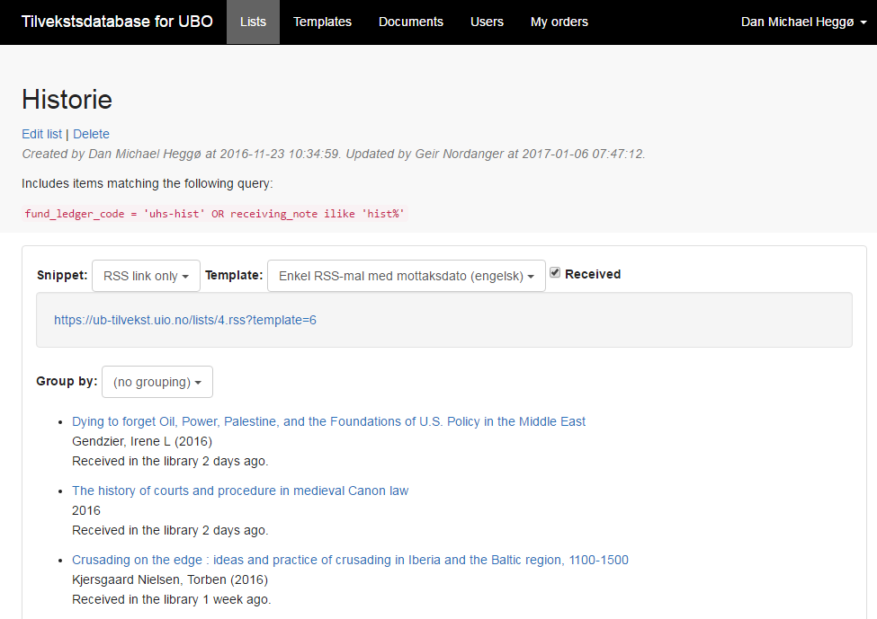
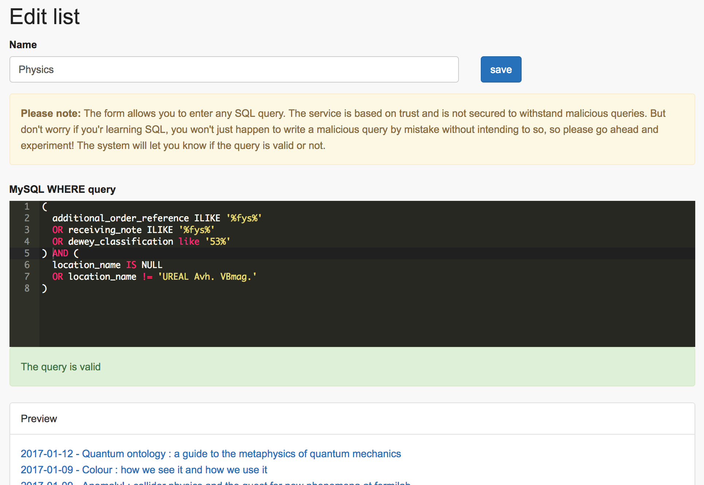

# alma-newbooks-db

A tool for creating lists of recent acquisitions from data harvested from
Alma Analytics nightly and stored in a local database.

Lists are defined by SQL queries and presented as RSS lists using Twig
templates.

Login can be configured to use SAML or a local login system.

A list from [ub-tilvekst.uio.no](https://ub-tilvekst.uio.no/):



The list editing interface:


The template editing interface:



## Installation

You need PHP 5.6.4+ and Composer, plus a quite recent version of NodeJS.
In the base directory, run:

    $ composer install
    $ npm install
    $ npm run prod

Copy `.env.example` to `.env` and edit it to include your database connection configuration
and an Alma API key from [Developer Network](https://developers.exlibrisgroup.com) (It needs
read access to both Analytics and Users. In the future, access to Bibs might also be needed).

For more configuration options, see `config/alma.php`, `config/saml2_settings.php` and other
files in the `config` directory.

Then create the database tables using:

    $ php artisan migrate

If you also want to add some templates to get you started, run:

    $ php artisan db:seed

To enable automatic harvesting every night, add

    * * * * * php /path/to/artisan schedule:run >> /dev/null 2>&1

to your crontab. This will check with the
[Laravel task scheduler](https://laravel.com/docs/5.5/scheduling) every minute
if there is something to, and exit right away if there isn't.

### Upgrading

    $ php artisan down      # Put the app in maintenance mode
    $ git pull              # (If using git)
    $ composer update       # Update PHP dependencies
    $ php artisan migrate   # Update the database schema, if changed
    $ npm install           # Update JS dependencies
    $ npm run prod          # Pack JS and CSS files
    $ php artisan up        # Done!

## Analytics setup

You need to setup the three analyses described below. Unfortunately there's no way
to paste a query into Oracle BI EE, so you need to drag and drop all the columns
and hope that you don't make a mistake.

For all date fields, set date format ODBC: YYYY-MM-DD.

### 1) `new_physical`: Physical books received recently

List of physical items sorted and limited by `"Receiving   Date"`, limited to
material types 'Audiobook', 'Blu-Ray', 'Blu-Ray And DVD', 'Book', 'DVD' or
'None' (we have lots of those). Specifically, we don't want 'Journal', 'Issue',
etc. The list of material types can be modified in Analytics at any time.

Excluding deleted items (lifecycle != "Deleted"), items whose bibliographic
record is `"Suppressed From Discovery"`, items without a valid PO Line reference.

```sql
SELECT
   0 s_0,
   "Physical Items"."Bibliographic Details"."Author" s_1,
   "Physical Items"."Bibliographic Details"."Bibliographic Level" s_2,
   "Physical Items"."Bibliographic Details"."Dewey Classification Top Line" s_3,
   "Physical Items"."Bibliographic Details"."Dewey Classification" s_4,
   "Physical Items"."Bibliographic Details"."Edition" s_5,
   "Physical Items"."Bibliographic Details"."MMS Id" s_6,
   "Physical Items"."Bibliographic Details"."Modification Date" s_7,
   "Physical Items"."Bibliographic Details"."Publication Date" s_8,
   "Physical Items"."Bibliographic Details"."Publication Place" s_9,
   "Physical Items"."Bibliographic Details"."Publisher" s_10,
   "Physical Items"."Bibliographic Details"."Series" s_11,
   "Physical Items"."Bibliographic Details"."Title" s_12,
   "Physical Items"."Fund Ledger"."Fund Ledger Code" s_13,
   "Physical Items"."Fund Ledger"."Fund Ledger Name" s_14,
   "Physical Items"."Fund Ledger"."Fund Type" s_15,
   "Physical Items"."Holding Details"."Holding Id" s_16,
   "Physical Items"."Holding Details"."Permanent Call Number" s_17,
   "Physical Items"."Location"."Library Name" s_18,
   "Physical Items"."Location"."Location Name" s_19,
   "Physical Items"."Physical Item Details"."Barcode" s_20,
   "Physical Items"."Physical Item Details"."Base Status" s_21,
   "Physical Items"."Physical Item Details"."Creation Date" s_22,
   "Physical Items"."Physical Item Details"."Creator" s_23,
   "Physical Items"."Physical Item Details"."Item Id" s_24,
   "Physical Items"."Physical Item Details"."Item Policy" s_25,
   "Physical Items"."Physical Item Details"."Material Type" s_26,
   "Physical Items"."Physical Item Details"."Process Type" s_27,
   "Physical Items"."Physical Item Details"."Receiving Date And Time" s_28,
   "Physical Items"."PO Line"."Acquisition Method" s_29,
   "Physical Items"."PO Line"."Additional Order Reference" s_30,
   "Physical Items"."PO Line"."Cancellation Reason" s_31,
   "Physical Items"."PO Line"."Order Line Type Code" s_32,
   "Physical Items"."PO Line"."Order Line Type" s_33,
   "Physical Items"."PO Line"."PO Creation Date" s_34,
   "Physical Items"."PO Line"."PO Line Creator" s_35,
   "Physical Items"."PO Line"."PO Line Modified By" s_36,
   "Physical Items"."PO Line"."PO Line Reference" s_37,
   "Physical Items"."PO Line"."PO Modification Date" s_38,
   "Physical Items"."PO Line"."Receiving Note" s_39,
   "Physical Items"."PO Line"."Receiving Status" s_40,
   "Physical Items"."PO Line"."Reporting Code" s_41,
   "Physical Items"."PO Line"."Sent Date" s_42,
   "Physical Items"."PO Line"."Source Type" s_43,
   "Physical Items"."PO Line"."Vendor Code" s_44,
   SUBSTRING("Physical Items"."Bibliographic Details"."ISBN" FROM 0 FOR POSITION(';' IN "Physical Items"."Bibliographic Details"."ISBN")-1) s_45
FROM "Physical Items"
WHERE
(("Bibliographic Details"."Suppressed From Discovery" = 'No') AND ("Physical Item Details"."Lifecycle" <> 'Deleted') AND ("PO Line"."PO Line Reference" LIKE 'POL-%') AND ("Physical Item Details"."Material Type" IN ('Audiobook', 'Blu-Ray', 'Blu-Ray And DVD', 'Book', 'DVD', 'None')))
ORDER BY 1, 29 DESC NULLS LAST, 2 ASC NULLS FIRST, 13 ASC NULLS FIRST, 11 ASC NULLS FIRST, 46 ASC NULLS FIRST, 5 ASC NULLS FIRST, 7 ASC NULLS FIRST, 6 ASC NULLS FIRST, 9 ASC NULLS FIRST, 4 ASC NULLS FIRST, 30 ASC NULLS FIRST, 38 ASC NULLS FIRST, 40 ASC NULLS FIRST, 41 ASC NULLS FIRST, 43 ASC NULLS FIRST, 12 ASC NULLS FIRST, 3 ASC NULLS FIRST, 20 ASC NULLS FIRST, 18 ASC NULLS FIRST, 23 ASC NULLS FIRST, 24 ASC NULLS FIRST, 21 ASC NULLS FIRST, 25 ASC NULLS FIRST, 27 ASC NULLS FIRST, 26 ASC NULLS FIRST, 17 ASC NULLS FIRST, 28 ASC NULLS FIRST, 22 ASC NULLS FIRST, 10 ASC NULLS FIRST, 19 ASC NULLS FIRST, 42 ASC NULLS FIRST, 14 ASC NULLS FIRST, 32 ASC NULLS FIRST, 35 ASC NULLS FIRST, 31 ASC NULLS FIRST, 33 ASC NULLS FIRST, 39 ASC NULLS FIRST, 37 ASC NULLS FIRST, 44 ASC NULLS FIRST, 45 ASC NULLS FIRST, 15 ASC NULLS FIRST, 16 ASC NULLS FIRST, 34 ASC NULLS FIRST, 36 ASC NULLS FIRST, 8 ASC NULLS FIRST
FETCH FIRST 500001 ROWS ONLY
```

### 2) `new_electronic`: Electronic books activated recently

E-inventory having `"Material Type" = 'Book'` (to exclude journals, etc.),
sorted and limited by `"Portfolio Activation Date"`.

Note: By including the PO Line Reference, the report is limited to single acquisitions
and does not include e-books from collections.

```sql
SELECT
   0 s_0,
   "E-Inventory"."Bibliographic Details"."Author" s_1,
   "E-Inventory"."Bibliographic Details"."Bibliographic Level" s_2,
   "E-Inventory"."Bibliographic Details"."Dewey Classification" s_3,
   "E-Inventory"."Bibliographic Details"."Edition" s_4,
   "E-Inventory"."Bibliographic Details"."ISBN" s_5,
   "E-Inventory"."Bibliographic Details"."MMS Id" s_6,
   "E-Inventory"."Bibliographic Details"."Modification Date" s_7,
   "E-Inventory"."Bibliographic Details"."Publication Date" s_8,
   "E-Inventory"."Bibliographic Details"."Publisher" s_9,
   "E-Inventory"."Bibliographic Details"."Series" s_10,
   "E-Inventory"."Bibliographic Details"."Title" s_11,
   "E-Inventory"."Electronic Collection"."Public Name" s_12,
   "E-Inventory"."Portfolio Activation Date"."Portfolio Activation Date" s_13,
   "E-Inventory"."Portfolio Creation Date"."Portfolio Creation Date" s_14,
   "E-Inventory"."Portfolio Library Unit"."Library Name" s_15,
   "E-Inventory"."Portfolio PO Line"."Additional Order Reference" s_16,
   "E-Inventory"."Portfolio PO Line"."PO Line Reference" s_17,
   "E-Inventory"."Portfolio"."Creator" s_18,
   "E-Inventory"."Portfolio"."Material Type" s_19,
   "E-Inventory"."Portfolio"."Portfolio Id" s_20
FROM "E-Inventory"
WHERE
(("Portfolio"."Material Type" = 'Book') AND ("Bibliographic Details"."Suppressed From Discovery" = 'No') AND ("Portfolio"."Life Cycle" = 'In Repository') AND ("Portfolio"."Availability" = 'Available'))
ORDER BY 1, 14 DESC NULLS LAST, 19 ASC NULLS FIRST, 18 ASC NULLS FIRST, 15 ASC NULLS FIRST, 20 ASC NULLS FIRST, 7 ASC NULLS FIRST, 12 ASC NULLS FIRST, 13 ASC NULLS FIRST, 21 ASC NULLS FIRST, 4 ASC NULLS FIRST, 5 ASC NULLS FIRST, 6 ASC NULLS FIRST, 10 ASC NULLS FIRST, 9 ASC NULLS FIRST, 11 ASC NULLS FIRST, 2 ASC NULLS FIRST, 3 ASC NULLS FIRST, 16 ASC NULLS FIRST, 8 ASC NULLS FIRST, 17 ASC NULLS FIRST
FETCH FIRST 500001 ROWS ONLY
```

### 3) `temporary_location`: Temporary location of items

All items with temporary locations, except resource sharing. We need a
separate query for this because some items disappeared mysteriously when
trying to add "Temporary Location" columns to the `new_physical` analysis.

```sql
SELECT
   0 s_0,
   "Physical Items"."Physical Item Details"."Item Id" s_1,
   "Physical Items"."Temporary Location"."Library Name" s_2,
   "Physical Items"."Temporary Location"."Location Name" s_3
FROM "Physical Items"
WHERE
((("Temporary Location"."Location Name" NOT LIKE '%Fjernlån%' AND "Temporary Location"."Location Name" NOT LIKE '%Sharing%' AND "Temporary Location"."Location Name" NOT LIKE '%None%')) AND ("Physical Item Details"."Temporary Physical Location In Use" = 'Yes'))
ORDER BY 1, 4 ASC NULLS FIRST, 2 ASC NULLS FIRST, 3 ASC NULLS FIRST
FETCH FIRST 500001 ROWS ONLY
```

### 4) `po_lines`: Active PO-lines

We include this query to be able to create lists of non-received books.

```sql
SELECT
   0 s_0,
   "Funds Expenditure"."Bibliographic Details"."Author" s_1,
   "Funds Expenditure"."Bibliographic Details"."Edition" s_2,
   "Funds Expenditure"."Bibliographic Details"."ISBN" s_3,
   "Funds Expenditure"."Bibliographic Details"."MMS Id" s_4,
   "Funds Expenditure"."Bibliographic Details"."Modification Date" s_5,
   "Funds Expenditure"."Bibliographic Details"."Publication Date" s_6,
   "Funds Expenditure"."Bibliographic Details"."Publication Place" s_7,
   "Funds Expenditure"."Bibliographic Details"."Publisher" s_8,
   "Funds Expenditure"."Bibliographic Details"."Series" s_9,
   "Funds Expenditure"."Bibliographic Details"."Title" s_10,
   "Funds Expenditure"."Dewey Classifications"."Dewey Number" s_11,
   "Funds Expenditure"."Fund Ledger"."Fund Ledger Code" s_12,
   "Funds Expenditure"."Fund Ledger"."Fund Ledger Name" s_13,
   "Funds Expenditure"."Fund Ledger"."Fund Type" s_14,
   "Funds Expenditure"."Fund Transaction Details"."Dewey Classification Top Line" s_15,
   "Funds Expenditure"."Library Unit"."Library Name" s_16,
   "Funds Expenditure"."PO Line"."Acquisition Method" s_17,
   "Funds Expenditure"."PO Line"."Additional Order Reference" s_18,
   "Funds Expenditure"."PO Line"."Expected Activation Date" s_19,
   "Funds Expenditure"."PO Line"."Expected Receiving Date" s_20,
   "Funds Expenditure"."PO Line"."Note To Vendor" s_21,
   "Funds Expenditure"."PO Line"."Order Line Type Code" s_22,
   "Funds Expenditure"."PO Line"."Order Line Type" s_23,
   "Funds Expenditure"."PO Line"."PO Line Creation Date" s_24,
   "Funds Expenditure"."PO Line"."PO Line Creator" s_25,
   "Funds Expenditure"."PO Line"."PO Line Modification Date" s_26,
   "Funds Expenditure"."PO Line"."PO Line Reference" s_27,
   "Funds Expenditure"."PO Line"."Receiving Note" s_28,
   "Funds Expenditure"."PO Line"."Receiving Status" s_29,
   "Funds Expenditure"."PO Line"."Sent Date" s_30,
   "Funds Expenditure"."PO Line"."Source Type" s_31,
   "Funds Expenditure"."Reporting Code"."Code" s_32,
   "Funds Expenditure"."Vendor"."Vendor Code" s_33
FROM "Funds Expenditure"
WHERE
(("PO Line"."Receiving Status" = 'No') AND ("Reporting Code"."Code" = 'PRINTBOOK') AND ("Fund Ledger"."Fund Type" = 'Allocated fund') AND ("PO Line"."Status" = 'ACTIVE') AND ("PO Line"."PO Line Reference" LIKE 'POL%') AND ("PO Line"."Order Line Type Code" IN ('PRINTED_BOOK_OT', 'PRINT_OT')) AND ("PO Line"."Receiving Date (Latest in POL)" IS NULL) AND ("PO Line"."Cancellation Reason" IS NULL))
ORDER BY 1, 31 DESC NULLS LAST, 18 ASC NULLS FIRST, 19 ASC NULLS FIRST, 33 ASC NULLS FIRST, 17 ASC NULLS FIRST, 12 ASC NULLS FIRST, 13 ASC NULLS FIRST, 21 ASC NULLS FIRST, 20 ASC NULLS FIRST, 22 ASC NULLS FIRST, 23 ASC NULLS FIRST, 25 ASC NULLS FIRST, 26 ASC NULLS FIRST, 29 ASC NULLS FIRST, 30 ASC NULLS FIRST, 11 ASC NULLS FIRST, 5 ASC NULLS FIRST, 4 ASC NULLS FIRST, 32 ASC NULLS FIRST, 3 ASC NULLS FIRST, 14 ASC NULLS FIRST, 2 ASC NULLS FIRST, 16 ASC NULLS FIRST, 7 ASC NULLS FIRST, 8 ASC NULLS FIRST, 9 ASC NULLS FIRST, 10 ASC NULLS FIRST, 15 ASC NULLS FIRST, 24 ASC NULLS FIRST, 34 ASC NULLS FIRST, 27 ASC NULLS FIRST, 28 ASC NULLS FIRST, 6 ASC NULLS FIRST
FETCH FIRST 500001 ROWS ONLY
```

## Development

To start a development server:

    php artisan serve

And optionally, if you work with js/css:

    gulp watch

## Queue driver

By default, harvest jobs are carried out synchronously (`QUEUE_DRIVER=sync` in `.env`).
There's really nothing wrong with that, but if you're in the mood for something else,
you can set `QUEUE_DRIVER=database` and fire up a background worker process that
processes the queue. The main benefit is that failed jobs are retried
automatically. The main drawback is that you must ensure the worker process keeps
running, so you need to configure something like supervisor. See the
[Laravel docs](https://laravel.com/docs/5.5/queues). Here's an example
`.ini` file:

```
[program:ub-tilvekst]
process_name=%(program_name)s_%(process_num)02d
command=php /path/to/almanewbooks/artisan queue:work database --sleep=3 --tries=3
autostart=true
autorestart=true
user=apache
numprocs=1
redirect_stderr=true
stdout_logfile=/path/to/almanewbooks/storage/logs/worker.log
```

A disadvantage of such a setup is that you need to restart the worker process
after you upgrade or make changes to the codebase:

    sudo supervisorctl restart ub-tilvekst:*

## Analytics quirks & lessons learned the hard way

* Null values are coded in many different ways. Some are empty, others hold the value
  "Unknown" or "UNASSIGNED location" or "0-00-00 00:00:00" for dates. I try to map them all to null.

* We have no control with how the joins are done in Analytics and we've run into various strange issues with the pre-defined joins:
  * In some analyses, the absence of a joined table value causes the whole row to
    be removed from the results (like when you do INNER JOIN instead of LEFT JOIN). With the four analyses defined above, we're not aware of any such
    issues, but they could be lurking around.
  * Including temporary location name in the physical items report led to exclusion
    of *a few* rows (not duplicates!) without temporary location, but not all. Number of rows dropped from 1315 to 1298 rows. I couldn't find a pattern in what rows dropped either, so I decided to exclude temporary location from the default analysis, and make a separate analysis just for those.
  * When preparing a report of items not yet received, I first tried to build it
    from `Physical Items`, but ran into what seemed like a join problem with
    `Fund Ledger`. While I got the correct number of rows, many of them erroneously contained blank values for the fund ledger columns. *Really* weird.
* If a PO line is using multiple funds, one row is returned per fund. To avoid
  duplicates, I'm currently just saving the first value, not all values. I wonder
  if the fund ledger codes could be joined together in Analytics in the same way
  ISBN numbers are (if there are multiple ISBn numbers, only one row is returned,
  with the values joined by semicolons (but it seems like that is pre-defined).
* From `Fund Expenditure`, filtering by `Receiving Status = No` included items
  that were actually received. Work-around: filtering by `Receiving Date (Latest in POL) IS NULL` instead.
* In general, bibliographic data from Analytics isn't always decent looking.
  In the future, we might need to harvest MARC21 data from the Alma Bib API
  to include all the bibliographic data we want to show.
  Some issues:
  * The `title` fields contain `245 $a` and `$b` concatenated using space, giving
    titles like "Maxwell's Enduring Legacy A Scientific History of the Cavendish Laboratory"
    rather than "Maxwell's Enduring Legacy : A Scientific History of the Cavendish Laboratory"
    when ISBD markers are not hard coded in the record.
  * The `series` include ISBD from `830 $x` and volume from `$v`:
    "Publications (Manchester Centre for Anglo-Saxon studies) 1478-6710 13"
  * The `author` fields contain information from `$d` (ex.: `Flo, Olav 1922-1989`),
    `$e` (ex.: `Gubernatis, J. E., author.`) and `$q` (`Jacobs, Kurt author. (Kurt Aaron),`)
  * The ISBN field contains a semicolon-separated list of isbn numbers, with
    no indication what number belongs to the item at hand.
  * Editors? Where are they?? Not shown in Primo either 
    (https://bibsys-almaprimo.hosted.exlibrisgroup.com:443/UBO:default_scope:BIBSYS_ILS71535636290002201).
